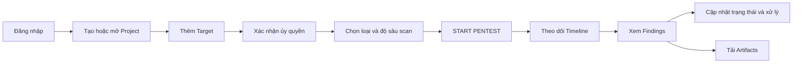

# Hướng dẫn sử dụng Web App GGT

**Đối tượng:** Người dùng nội bộ thực hiện và theo dõi kiểm thử bảo mật được ủy quyền  
**Phạm vi:** Các chức năng hiện có của GGT Phase 1  
**Địa chỉ local mặc định:** `http://localhost:5173`

> GGT chỉ được sử dụng với ứng dụng, API hoặc mã nguồn thuộc sở hữu của tổ chức hoặc đã có văn bản/ủy quyền kiểm thử bảo mật rõ ràng. Không nhập hoặc quét mục tiêu của bên thứ ba khi chưa được phép.

## 1. GGT dùng để làm gì?

GGT hỗ trợ đội bảo mật và phát triển:

- Quản lý dự án pentest.
- Khai báo mục tiêu Web, API hoặc mã nguồn.
- Xác nhận quyền kiểm thử đối với từng mục tiêu.
- Khởi chạy Strix theo nhiều loại và độ sâu quét.
- Theo dõi tiến trình pentest theo thời gian gần thực.
- Xem, lọc và xử lý các phát hiện bảo mật.
- Tải logs và artifacts của lượt quét để kiểm tra, đối soát.

Luồng sử dụng tổng quát:



## 2. Quyền người dùng

| Vai trò | Quyền chính |
|---|---|
| `ADMIN` | Quản lý toàn bộ dự án, target, pentest và trạng thái finding. |
| `SECURITY` | Tạo/quản lý dự án và target, bắt đầu/hủy pentest, đánh giá và cập nhật mọi trạng thái finding. |
| `DEVELOPER` | Xem dự án được phân công và đánh dấu finding thành `FIXED_PENDING_RETEST`. |
| `VIEWER` | Chỉ xem các dự án, lượt quét và finding được phép truy cập. |

Một số nút hoặc ô chọn trạng thái có thể vẫn hiển thị trên giao diện đối với vai trò không đủ quyền. API sẽ từ chối thao tác bằng lỗi `403`. Khi gặp trường hợp này, liên hệ `ADMIN` hoặc `SECURITY`.

## 3. Đăng nhập

1. Mở `http://localhost:5173`.
2. Nhập **Email** và **Password** do quản trị viên cung cấp.
3. Chọn **Sign in**.
4. Sau khi đăng nhập thành công, hệ thống chuyển tới **Dashboard**.

Để đăng xuất, chọn **Sign out** ở cuối thanh menu bên trái.

## 4. Dashboard

Dashboard hiển thị:

- **Projects:** Tổng số dự án người dùng có thể xem.
- **Running pentests:** Các lượt quét đang ở trạng thái hoạt động.
- **Completed pentests:** Số lượt quét đã hoàn tất.
- **Failed pentests:** Số lượt quét thất bại.
- **Critical/High/Medium/Low findings:** Thống kê finding của 5 lượt quét hoàn tất gần nhất.
- **Recent Pentest Runs:** 8 lượt quét gần nhất.

Chọn **View** tại một lượt quét để mở trang chi tiết.

## 5. Tạo và mở dự án

### Tạo dự án

Chức năng này dành cho `ADMIN` và `SECURITY`.

1. Chọn **Projects** trên menu trái.
2. Tại phần **New project**, nhập:
   - **Name:** Tên dự án, bắt buộc.
   - **Description:** Mô tả ứng dụng hoặc phạm vi kiểm thử, không bắt buộc.
3. Chọn **Create project**.
4. Dự án mới xuất hiện trong danh sách.

### Mở dự án

1. Trong danh sách **Projects**, tìm dự án cần thao tác.
2. Chọn **Open**.
3. Trang dự án hiển thị target, thành viên, các lượt pentest gần đây và form thêm target.

## 6. Thêm mục tiêu kiểm thử

Chức năng này dành cho `ADMIN` và `SECURITY`.

1. Mở trang chi tiết dự án.
2. Tại **Add target**, chọn **Type**:

| Type | Sử dụng khi | Giá trị Target |
|---|---|---|
| `WEB` | Kiểm thử ứng dụng web đang chạy | URL đầy đủ, ví dụ `https://staging.example.com` |
| `API` | Kiểm thử API đang chạy | Base URL của API, ví dụ `https://api-staging.example.com` |
| `SOURCE` | Phân tích mã nguồn | GitHub repository URL, ví dụ `https://github.com/org/repo`, hoặc URI gói `.tar.gz` trên S3 |

3. Chọn **Environment**:
   - `DEV`: Môi trường phát triển.
   - `STAGING`: Môi trường kiểm thử; lựa chọn được khuyến nghị.
   - `PRODUCTION`: Chỉ chọn khi có phê duyệt riêng và đã đánh giá rủi ro vận hành.
4. Với `SOURCE`, có thể nhập thêm **Branch** và **Commit SHA**.
5. Kiểm tra lại target chính xác.
6. Tick xác nhận:

   > I confirm this target is owned by the company or explicitly authorized for security testing.

7. Chọn **Add target**.
8. Kiểm tra cột **Authorized** hiển thị `Yes`.

Target chưa được xác nhận sẽ không xuất hiện trong danh sách lựa chọn khi bắt đầu pentest.

## 7. Chọn loại pentest

GGT hỗ trợ bốn loại scan:

| Loại scan | Target bắt buộc | Credential | Mục đích |
|---|---|---|---|
| `SOURCE_REVIEW` | Ít nhất 1 `SOURCE` | Không dùng | Phân tích mã nguồn, không cần ứng dụng đang chạy. |
| `BLACK_BOX` | Ít nhất 1 `WEB` hoặc `API` | Không dùng | Kiểm thử từ bên ngoài, không có mã nguồn hoặc tài khoản. |
| `AUTHENTICATED` | Ít nhất 1 `WEB` hoặc `API` | Bắt buộc | Kiểm thử bằng tài khoản test đã được ủy quyền. |
| `WHITE_BOX` | `SOURCE` và `WEB`/`API` | Không bắt buộc | Kết hợp mã nguồn với ứng dụng đang chạy. |

Credential không được nhập vào **Custom Security Instructions**. Với scan `AUTHENTICATED`, nhập ARN của secret vào **Credential Secret ARN**; secret do quản trị viên chuẩn bị trong Secrets Manager đang được GGT cấu hình sử dụng.

## 8. Chọn độ sâu pentest

| Scan Depth | Khuyến nghị sử dụng |
|---|---|
| `QUICK` | Kiểm tra nhanh, smoke test hoặc xác nhận cấu hình. |
| `STANDARD` | Mức mặc định cho pentest thông thường. |
| `DEEP` | Phân tích sâu hơn; thời gian và lượng tài nguyên sử dụng có thể cao hơn. |

Không nên bắt đầu bằng `DEEP` trên Production. Hãy chạy `QUICK` hoặc `STANDARD` trên Staging trước.

## 9. Khởi chạy pentest

Chức năng này dành cho `ADMIN` và `SECURITY`.

1. Chọn **Start pentest** trên menu trái; hoặc mở dự án và chọn **Start pentest**.
2. Chọn **Project**.
3. Chọn **Scan Type**.
4. Chọn target theo yêu cầu của loại scan:
   - **Source Target** cho `SOURCE_REVIEW` hoặc `WHITE_BOX`.
   - **Web/API Target** cho `BLACK_BOX`, `AUTHENTICATED` hoặc `WHITE_BOX`.
5. Với `AUTHENTICATED`, nhập **Credential Secret ARN**.
6. Chọn **Scan Depth**.
7. Nếu cần, nhập **Custom Security Instructions**, ví dụ:

   ```text
   Focus on authentication, authorization, IDOR and business logic.
   ```

   Không nhập password, token, API key hoặc dữ liệu cá nhân vào trường này.
8. Tick xác nhận quyền kiểm thử ở cuối form.
9. Chọn **START PENTEST**.
10. GGT tạo lượt quét ở trạng thái `QUEUED` và tự chuyển sang trang chi tiết.

Nút **START PENTEST** chỉ được bật khi project, target, credential bắt buộc và checkbox xác nhận đã đầy đủ.

## 10. Theo dõi lượt pentest

Trang chi tiết tự làm mới khoảng 4 giây một lần khi lượt quét đang hoạt động.

| Trạng thái | Ý nghĩa |
|---|---|
| `QUEUED` | Yêu cầu đã được tạo và đang chờ Worker nhận. |
| `PREPARING` | Worker đã nhận job, đang chuẩn bị target/workspace/credential. |
| `RUNNING` | Strix đang thực hiện pentest. |
| `PROCESSING_RESULTS` | GGT đang chuẩn hóa và lưu findings. |
| `COMPLETED` | Pentest và xử lý kết quả đã hoàn tất. |
| `FAILED` | Pentest thất bại; xem error banner và Timeline. |
| `CANCELLED` | Người dùng đã yêu cầu hủy lượt quét. |

Phần **Timeline** thể hiện các bước như Worker nhận job, tải source, Strix bắt đầu, xử lý kết quả và hoàn tất.

### Hủy lượt pentest

1. Mở trang chi tiết lượt quét đang hoạt động.
2. Chọn **Cancel run**.
3. Trạng thái chuyển thành `CANCELLED` nếu user có quyền.

Giới hạn hiện tại: nếu Strix đã chạy, thao tác hủy cập nhật trạng thái trên GGT nhưng process Strix có thể tiếp tục cho tới khi tự hoàn tất. Không dùng nút hủy như một cơ chế dừng khẩn cấp; khi cần dừng ngay, liên hệ người vận hành Worker.

## 11. Xem findings

Findings chỉ được tải lên giao diện khi lượt quét không còn ở trạng thái hoạt động.

1. Mở lượt pentest có trạng thái `COMPLETED` hoặc `FAILED`.
2. Tại **Findings**, dùng bộ lọc:
   - **All severities:** `CRITICAL`, `HIGH`, `MEDIUM`, `LOW`, `INFO`.
   - **All statuses:** trạng thái xử lý finding.
3. Chọn một dòng finding để xem chi tiết:
   - Category và CWE.
   - Endpoint và HTTP method.
   - Source file và dòng mã nguồn, nếu có.
   - Description.
   - Evidence summary.
   - Proof of Concept.
   - Impact.
   - Recommendation.

PoC và evidence chỉ dùng trong phạm vi khắc phục nội bộ. Không chuyển tiếp ra ngoài nhóm được phép truy cập.

## 12. Cập nhật trạng thái finding

| Trạng thái | Ý nghĩa đề xuất |
|---|---|
| `OPEN` | Mới phát hiện, chưa đánh giá. |
| `CONFIRMED` | Đã được Security xác nhận là hợp lệ. |
| `FIXING` | Đội phát triển đang khắc phục. |
| `FIXED_PENDING_RETEST` | Đã sửa và đang chờ kiểm tra lại. |
| `VERIFIED_FIXED` | Security đã retest và xác nhận đã khắc phục. |
| `FALSE_POSITIVE` | Kết quả không phải lỗ hổng thực tế. |
| `ACCEPTED_RISK` | Rủi ro đã được chấp nhận theo quy trình nội bộ. |

Cách cập nhật:

1. Chọn finding trong danh sách.
2. Tại trường **Status**, chọn trạng thái mới.
3. GGT lưu thay đổi ngay và ghi audit log.

`ADMIN` và `SECURITY` có thể chọn mọi trạng thái. `DEVELOPER` chỉ có thể chuyển finding thành `FIXED_PENDING_RETEST`. `VIEWER` không thể cập nhật.

## 13. Tải artifacts

Sau khi lượt quét kết thúc, phần **Artifacts** có thể hiển thị:

- `stdout.log`: Output chuẩn của Strix.
- `stderr.log`: Log lỗi/cảnh báo của Strix.
- `vulnerabilities.json`: Findings thô trước khi chuẩn hóa.
- `metadata.json`: Mã lượt Strix, exit code, thời lượng và cảnh báo parser.

Chọn **Download** để mở đường dẫn tải tạm thời. Link tải có thời hạn ngắn; tải lại trang để tạo link mới khi link hết hạn.

Artifacts có thể chứa thông tin kỹ thuật nhạy cảm. Chỉ lưu trữ và chia sẻ theo chính sách bảo mật của tổ chức.

## 14. Xử lý sự cố thường gặp

### Nút START PENTEST không được bật

Kiểm tra:

- Đã chọn Project chưa.
- Project có target đúng loại và cột **Authorized** là `Yes` chưa.
- `SOURCE_REVIEW` đã chọn Source Target chưa.
- `BLACK_BOX` đã chọn Web/API Target chưa.
- `AUTHENTICATED` đã chọn Web/API Target và nhập Credential Secret ARN chưa.
- `WHITE_BOX` đã chọn cả Source Target và Web/API Target chưa.
- Đã tick checkbox xác nhận ở cuối form chưa.

### Không thấy target trong danh sách

- Target chưa được xác nhận ủy quyền.
- Target không thuộc project đang chọn.
- Loại target không phù hợp với Scan Type.
- Tải lại trang sau khi thêm target.

### Lượt quét đứng ở QUEUED

Worker hoặc queue có thể chưa hoạt động. Người dùng liên hệ quản trị viên và cung cấp Run ID/đường dẫn trang pentest.

### Lượt quét FAILED

1. Đọc error banner ở đầu trang.
2. Xem sự kiện cuối trong Timeline.
3. Kiểm tra `stderr.log` trong Artifacts nếu file đã được lưu.
4. Không chạy lại liên tục khi chưa xác định nguyên nhân.

### COMPLETED nhưng không có finding

Điều này có thể có nghĩa Strix không phát hiện lỗ hổng, hoặc output không được parser nhận dạng. Kiểm tra artifacts và liên hệ Security nếu kết quả không phù hợp với kỳ vọng.

### Nhận lỗi 403

Tài khoản không có quyền thực hiện thao tác hoặc không thuộc project. Liên hệ `ADMIN` để kiểm tra role và project membership.

## 15. Nguyên tắc sử dụng an toàn

- Chỉ scan target đã được phê duyệt.
- Ưu tiên `DEV` hoặc `STAGING`.
- Không đưa credential vào target URL hoặc Custom Security Instructions.
- Không chạy nhiều pentest đồng thời trên cùng target.
- Không dùng `DEEP` trên Production nếu chưa có phê duyệt vận hành.
- Đánh giá thủ công trước khi xác nhận finding hoặc chuyển cho đội phát triển.
- Bảo vệ artifacts, PoC và evidence như dữ liệu bảo mật nội bộ.

## 16. Giới hạn phiên bản hiện tại

- Giao diện chưa tích hợp Jira và Slack.
- Chưa có báo cáo PDF hoàn chỉnh trên UI.
- Hủy lượt quét đang chạy chưa đảm bảo dừng ngay process Strix.
- Dashboard chỉ thống kê severity từ 5 lượt `COMPLETED` gần nhất.
- Kết quả phụ thuộc vào định dạng output của phiên bản Strix đang cài đặt; khi nghi ngờ cần đối chiếu artifacts thô.
